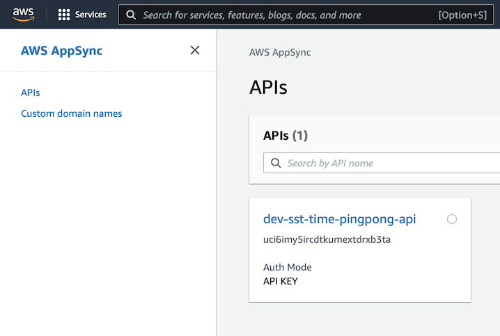
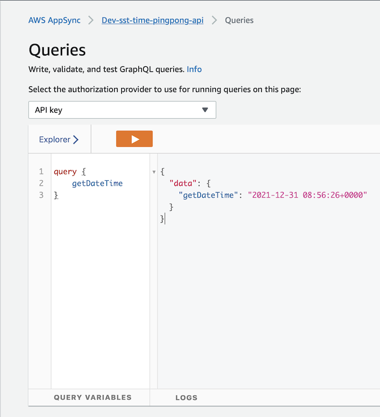

# Run GraphQL operations


import Tabs from '@theme/Tabs';
import TabItem from '@theme/TabItem';

export const Row = ({ children }) => (
    <div className="container">
        <div className="row">
            {children}
        </div>
    </div>
);

Head over to AWS AppSync using the AWS Management Console, and open the deployed API.

<!--  -->

Next, from the sidebar, click on Queries. Let's execute a `getDateTime` query and a
`pong` mutation. 

### Execute Query.getDateTime

<Row>
<div className="col col--5">

```graphql title="Operation"
# GraphQL operation for the
#   Query.getDateTime resolver
query {
    getDateTime
}
```

</div>
<div className="col col--7">

```json title="Result"
{
  "data": {
    "getDateTime": "2021-12-30 08:56:26+0000"
  }
}
```

</div>
</Row>


### Execute Mutation.pong


<Row>
<div className="col col--5">

```graphql title="Operation"
# GraphQL operation for the
#   Mutation.pong resolver
mutation {
    pong(word: "I am groot")
}
```

</div>
<div className="col col--7">

```json title="Result"
{
    "data": {
        "pong": "toorg ma I"
    }
}
```

</div>
</Row>

<!--  -->

## Congratulations!

You have just learned the basics of **AppSync Butler** 🎉! Using what you have learned,
you can now deploy a more complex GraphQL API backing a DynamoDB table.

Can you improve the docs? [Please submit a PR!](https://github.com/alichry/appsync-butler)

## What's next?

- Read the [API documentation](/docs/api)
- [Define a variable](/docs/api/classes/appsync_butler_core.Parser#setvariable) in your AppSync Mapping Template.
- Tweet about your experience with AppSync Butler.
- Looking to contribute? Let's discuss more on [Gitter](https://gitter.im/appsync-butler/community?utm_source=share-link&utm_medium=link&utm_campaign=share-link) to get started.